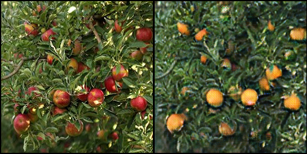

# Homework 1 (Color-Transfer and Texture-Transfer)

A clean and readable Pytorch implementation of CycleGAN (https://arxiv.org/abs/1703.10593)
## Assign

1.  20% (Training cycleGAN)  

apple2orange
.pth file:  
https://drive.google.com/open?id=1tWkLkqdDhNvoUGR39Q6huuqW2OERd4m7  

2.  10% (Inference cycleGAN in personal image)  

apple to orange  
  
orange to apple  
  

3.  20% (Compare with other method)  

Here we compare CycleGAN with [Image Analogies](https://www.mrl.nyu.edu/publications/image-analogies/analogies-fullres.pdf) discussed in the lecture. We only focus on the application of orange to apple texture transfer. The code used for this comparison is from the [website](https://www.mrl.nyu.edu/projects/image-analogies/lf/) they provided.  

Below is the result using Image Analogies. The two on the left are the paired images A, A'. The other two on the right are the input image and the output result.  
  
Compare with the result from CycleGAN  
  
We can see that CycleGAN is better on preserving the structure of the image while Image Analogies only captures the general style.Thus,if we look closely to the Image analogies one we can see that the output image does not match what real apples should look like,the structure of them collapse,there is no well-structured apple in the output image.As we go to the CycleGAN ouput image,it is a well-structured apple and the texture of them are closer to the real one.

As for the resources needed to generate the image. CycleGAN needs lots of training data and training time. Powerful GPUs are also needed to accelerate the training process. On the other hand, Image Analogies only needs 2 carefully picked images as example images and the time is mainly spent on inference not training.

| Method           | Training Time | Inference Time |
| ---------------- | ------------- | -------------- |
| CycleGAN         |      41hr     |      < 1s      |
| Image Analogies  |      < 1s     |       49s      |


4.  30% (Assistant)
5.  20% (Mutual evaluation)

reference:
[Super fast color transfer between images](https://github.com/jrosebr1/color_transfer)

## Getting Started
Please first install [Anaconda](https://anaconda.org) and create an Anaconda environment using the environment.yml file.

```
conda env create -f environment.yml
```

After you create the environment, activate it.
```
source activate hw1
```

Our current implementation only supports GPU so you need a GPU and need to have CUDA installed on your machine.

## Training
### 1. Download dataset

```
mkdir datasets
bash ./download_dataset.sh <dataset_name>
```
Valid <dataset_name> are: apple2orange, summer2winter_yosemite, horse2zebra, monet2photo, cezanne2photo, ukiyoe2photo, vangogh2photo, maps, cityscapes, facades, iphone2dslr_flower, ae_photos

Alternatively you can build your own dataset by setting up the following directory structure:

    .
    ├── datasets                   
    |   ├── <dataset_name>         # i.e. apple2orange
    |   |   ├── trainA             # Contains domain A images (i.e. apple)
    |   |   ├── trainB             # Contains domain B images (i.e. orange)
    |   |   ├── testA              # Testing
    |   |   └── testB              # Testing

### 2. Train
```
python train.py --dataroot datasets/<dataset_name>/ --cuda
```
This command will start a training session using the images under the *dataroot/train* directory with the hyperparameters that showed best results according to CycleGAN authors.

Both generators and discriminators weights will be saved ```./output/<dataset_name>/``` the output directory.

If you don't own a GPU remove the --cuda option, although I advise you to get one!


## Testing
The pre-trained file is on [Google drive](https://drive.google.com/open?id=17FREtttCyFpvjRJxd4v3VVlVAu__Y5do). Download the file and save it on  ```./output/<dataset_name>/netG_A2B.pth``` and ```./output/<dataset_name>/netG_B2A.pth```.

```
python test.py --dataroot datasets/<dataset_name>/ --cuda
```
This command will take the images under the ```dataroot/testA/``` and ```dataroot/testB/``` directory, run them through the generators and save the output under the ```./output/<dataset_name>/``` directories.

Examples of the generated outputs (default params) apple2orange, summer2winter_yosemite, horse2zebra dataset:


## Acknowledgments
Code is modified by [PyTorch-CycleGAN](https://github.com/aitorzip/PyTorch-CycleGAN). All credit goes to the authors of [CycleGAN](https://arxiv.org/abs/1703.10593), Zhu, Jun-Yan and Park, Taesung and Isola, Phillip and Efros, Alexei A.
